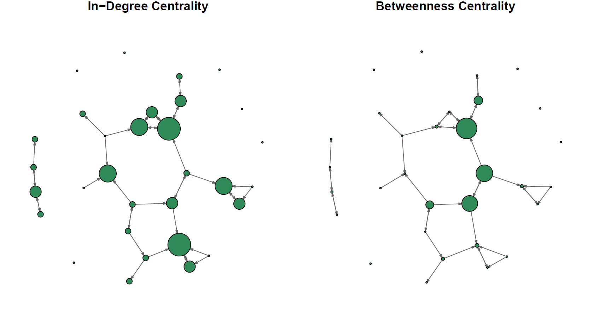

# Centrality & Network Analysis

## Purpose
An exploratory network-analysis project using a directed teacher friendship network. It demonstrates cohesion measures, node centrality, and visual comparison of in-degree and betweenness.

## Methods
`centrality-analysis.R` reads the adjacency matrix and node attributes with `igraph`, constructs a directed graph, and calculates weak components, density, compactness, dyadic reciprocity, global clustering (transitivity), in-degree, and normalized betweenness. The published plots size nodes by in-degree or betweenness using a fixed layout seed.

Reported results include 8 weak components, density 0.042, compactness 0.181, reciprocity 0.393, and global clustering coefficient 0.200. The most prominent actors in the supplied analysis were AE and AX by in-degree, and AE and AL by betweenness.

## Files
- `centrality-analysis.R` — reproducible analysis script with project-relative inputs.
- `teacher-friendship-adjacency.csv` — directed adjacency matrix; a 1 in row *i*, column *j* represents a reported friendship from *i* to *j*.
- `teacher-network-attributes.csv` — node-level attributes. `ID` is the node identifier; `Gender`, `Gradelevel`, and `Position` are coded categorical fields; `YrsCurPos` and `YrsCurSite` are tenure-in-years fields; `OverallTrust` and `DistClimateLrn` are numeric survey measures. Codebook details for the coded fields are not included in the source materials.
- `centrality-network-analysis.png`, `centrality-graphs.pdf` — network visual outputs.
- `cohesion-centrality-report.pdf` — original assignment report.

## Visualizations

*Network views comparing in-degree and betweenness centrality.*

See the [centrality graphs PDF](centrality-graphs.pdf) for the accompanying graph figures.

## Data sources and permissions
The CSVs are the original teacher friendship and attribute files supplied for the assignment. Publication was explicitly authorized by the project owner. Node IDs are pseudonymous codes in the supplied files; no names or direct contact details are included. Do not attempt to re-identify individuals, and verify institutional/participant permissions before redistribution beyond this portfolio context.

## Limitations
The network records reported friendship ties, not all social or professional relationships. Directed ties may be unreciprocated, the sample is limited to one school context, and coded attributes lack a complete codebook. Measures depend on graph construction choices and should not be generalized to other populations.

## Reproducibility
Run the R script from this repository directory with R and the `igraph` package installed. It expects the two CSV files at the repository root and writes/plots results in the active R session. The supplied script preserves the original analysis logic while removing machine-specific paths.
